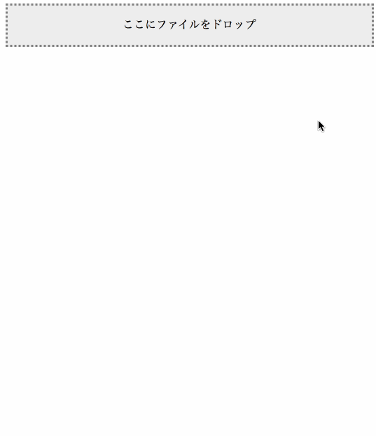

# NCMBへのファイルアップロードを行うjQueryプラグイン



## 読み込み

JavaScript、CSSをそれぞれ読み込んでください。

## 使い方

必要な引数はニフティクラウド mobile backendのアプリケーションキー、クライアントキーそして管理画面のURLから取得するアプリケーションIDとなっています。

```javascript
$(() => {
    const applicationKey = 'YOUR_APPLICATION_KEY';
    const clientKey = 'YOUR_CLIENT_KEY';
    const applicationId = 'YOUR_APPLICATION_ID';
	$('#drag-drop-area').fileUpload({
        applicationKey: applicationKey,
        clientKey: clientKey,
        applicationId: applicationId
    }, (urls) => {
        // ファイルストアへアクセスするURLが返ってきます
  	    for (let url of urls) {
    	    $('.results').append(`<br />`);
        }
    }, (err) => {
    });
});
```

## 依存ライブラリ

- jQuery

## License

MIT License

